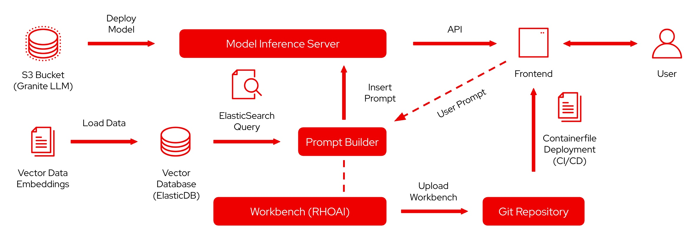

# 🧠 GitHub Helpdesk Chatbot (Streamlit + RAG + LLM)

This project is an intelligent **conversational helpdesk chatbot** that summarizes, clarifies, and answers user queries based on real GitHub issues and solution threads. It acts like a **friendly technical support assistant** powered by modern AI retrieval and reasoning.

## 🚀 Features

- 🔍 **Retrieves real GitHub issue solutions** based on semantic similarity.
- 💬 **Conversational and adaptive troubleshooting assistant** that guides users through clarifying their problems.
- 🧠 **Retrieval-Augmented Generation (RAG)** to combine search + LLM generation.
- 🛜 **Scalable Elasticsearch backend** for fast vector similarity search.
- 📊 **Professional, friendly Streamlit-based user interface**.
- 🛡️ **Dynamic behavior control** (guiding questions → follow-ups → general causes).
- 🖥️ **Backend library separated cleanly for reuse or scaling**.

### ⚙️ Setup Instructions
For this Chatbot PoC, the following resources are needed:
1. OpenShift Cluster (We used ROSA for this specific PoC)  
   a. 2 worker nodes – `g4dn.12xlarge` for GPU node, `m6a.4xlarge` for non-GPU node  
   b. 1 master node + 2 infra nodes (optional)
2. Working Openshift AI installation ([Installing and Deploying OpenShift AI](https://docs.redhat.com/en/documentation/red_hat_openshift_ai_self-managed/2.20/html/installing_and_uninstalling_openshift_ai_self-managed/installing-and-deploying-openshift-ai_install#installing-and-deploying-openshift-ai_install))

## 🧩 How It Works

1. **Semantic Retrieval**
   - User question is converted into an embedding vector.
   - Search for the top matching GitHub answers stored in Elasticsearch.

2. **Context Injection**
   - Retrieved past discussions are optionally injected into the conversation if they are truly relevant.

3. **Behavior-Aware Chat**
   - If the user query is vague, the chatbot dynamically asks guiding questions.
   - If clarification is still partial, the bot follows up intelligently.
   - After multiple unclear rounds, it suggests general causes politely.

4. **LLM Reasoning**
   - A lightweight LLM model hosted on OpenShift AI generates conversational responses.

5. **Frontend Experience**
   - A clean Streamlit app shows user questions, assistant responses, and tracks the chat history interactively.

## 🛠️ Tech Stack

| Component         | Technology Used                                  |
|-------------------|--------------------------------------------------|
| Embedding Model    | `sentence-transformers (multi-qa-MiniLM-L6-cos-v1)` |
| Semantic Search    | `Elasticsearch 8.10.0` (vector KNN search)       |
| LLM Inference      | Granite 3.2 8b Instruct on vLLM v0.7.3 |
| Web App            | `Streamlit` (dynamic chat UI)                   |
| RAG Orchestration  | Custom lightweight backend logic (Python)       |
| Cloud Deployment   | Red Hat Openshift Service on AWS (for backend + frontend hosting)       |

## 📁 Folder Structure

```plaintext
📂 app/                    # Streamlit frontend (user chat interface)
📂 backend_chatbot/         # Chatbot backend logic (send_message, RAG retrieval, reset_conversation)
📂 data/                    # Raw + cleaned GitHub helpdesk data
📂 embeddings/              # Scripts to create and upload embeddings to Elasticsearch
📂 models/                  # (Optional) Model configs and deployment scripts
📂 scripts/                 # Data cleaning, processing, ETL
requirements.txt            # All Python dependencies
README.md                   # This file
```
## 📚 Dataset Description: GitHub Issue Helpdesk Conversations
This chatbot uses a real-world GitHub helpdesk dataset containing issue threads and solutions extracted from open-source repositories.

### 🔑 **Key Fields**
| Field Name       | Description                                                       |
|------------------|---------------------------------------------------------------------|
| `issue_id`       | Unique identifier for each GitHub issue thread.                    |
| `answer_id`      | Sequential number representing the reply order within a thread.    |
| `issue_body`     | Cleaned description of the original user-submitted problem.         |
| `answer_body`    | Cleaned response/comment posted in reply to the issue.              |
| `author`         | GitHub username of the person who posted the reply.                 |
| `creation_time`  | Timestamp when the reply or comment was created.                    |

---

### 🧼 Cleaning Highlights

- Replaced raw URLs with a simple `<link>` tag.
- Removed GitHub user mentions (e.g., `@user`) and internal issue references (e.g., `#123`).
- Cleaned unnecessary whitespace and formatting inconsistencies while preserving important structure (code blocks, bullet points, etc.).

➡️ Original Dataset: [Kaggle Github Helpdesk Tickets](https://www.kaggle.com/datasets/tobiasbueck/helpdesk-github-tickets)

### 🧪 Example Usage
🗨️ "I'm facing a Serial Monitor freezing issue with my Arduino IDE. What could be the problem?"

✅ The chatbot will retrieve similar cases from the database, summarize relevant solutions, and politely guide the user through possible fixes step-by-step.

### Chatbot Architecture
For our Chatbot, we made use of only RAG and Prompt Engineering due to limitations in GPU resources. Model fine tuning could also be used to improve the functionality, but at a higher resource cost.<br>

The chatbot has 3 main workflow pipelines:
1. Model serving pipeline
2. RAG pipeline
3. CI/CD Pipeline for Application Deployment



Here is how the chatbot decides when to perform the RAG retrieval for context during a conversation with a user:


This is the chatbot flow digram after user inputs query


### 🤝 Contributing
Pull requests are welcome! This is a PoC that is still a work in progress, so please feel free to suggest improvements to the retrieval system, LLM prompting, or frontend UX.<br> 
If you spot bugs or want to add new features, please open an issue or submit a PR.

### 📄 License

This project is licensed under the MIT License:

MIT License

Copyright (c) 2025 Red Hat, Inc.

Permission is hereby granted, free of charge, to any person obtaining a copy
of this software and associated documentation files (the "Software"), to deal
in the Software without restriction, including without limitation the rights
to use, copy, modify, merge, publish, distribute, sublicense, and/or sell
copies of the Software, and to permit persons to whom the Software is
furnished to do so, subject to the following conditions:

The above copyright notice and this permission notice shall be included in all
copies or substantial portions of the Software.

THE SOFTWARE IS PROVIDED "AS IS", WITHOUT WARRANTY OF ANY KIND, EXPRESS OR
IMPLIED, INCLUDING BUT NOT LIMITED TO THE WARRANTIES OF MERCHANTABILITY,
FITNESS FOR A PARTICULAR PURPOSE AND NONINFRINGEMENT. IN NO EVENT SHALL THE
AUTHORS OR COPYRIGHT HOLDERS BE LIABLE FOR ANY CLAIM, DAMAGES OR OTHER
LIABILITY, WHETHER IN AN ACTION OF CONTRACT, TORT OR OTHERWISE, ARISING FROM,
OUT OF OR IN CONNECTION WITH THE SOFTWARE OR THE USE OR OTHER DEALINGS IN THE
SOFTWARE.
